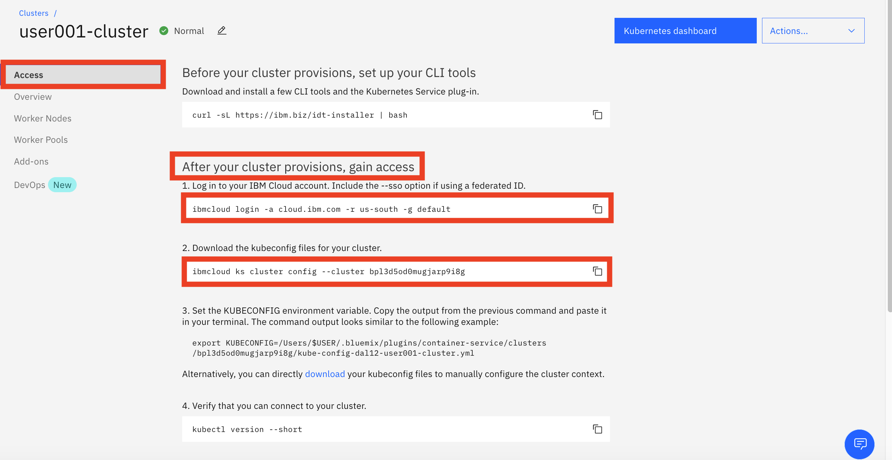

# Exercise 0. Connect to Kubernetes cluster

Complete steps in this section to connect to your Kubernetes cluster.

1. Open a terminal window or command window.

    > **Note: use a web terminal if you attend a workshop**

1. Set an environment variable

    ```
    export USERNAME=user###
    ```

    > **Note: replace ### with your assigned ID**

1. Login to [Kubernetes service in IBM Cloud](https://cloud.ibm.com/kubernetes/clusters).

1. Select your Kubernetes cluster.

1. Navigate to `Access` tab.

    

1. In the above terminal window, complete all steps in the section `After your cluster provisions, gain access` on your Kubernetes cluster window, including

    - Log in to your IBM Cloud account. Include the --sso option if using a federated ID.
    - Download the kubeconfig files for your cluster.
    - Set the KUBECONFIG environment variable.


