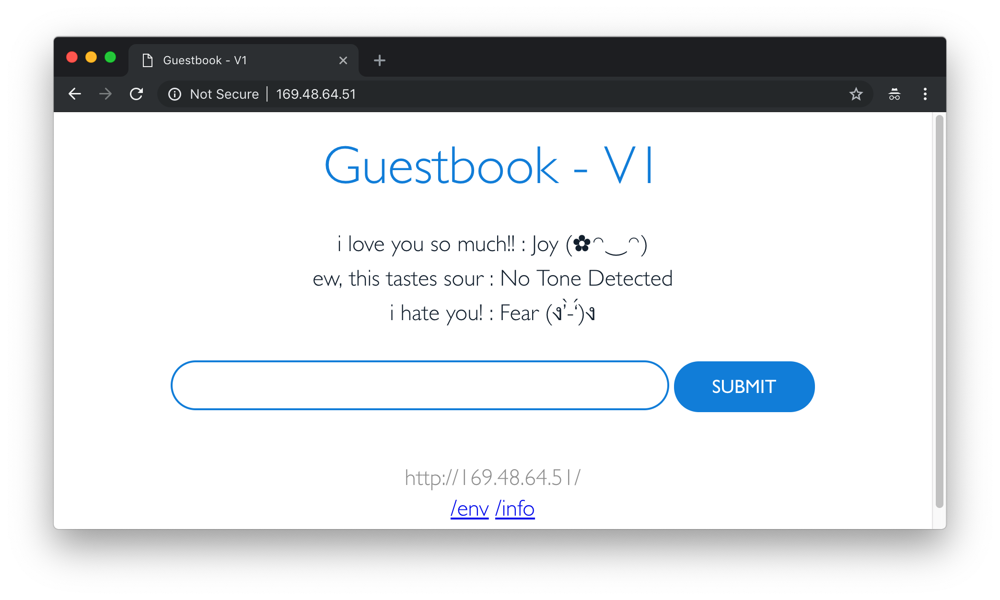
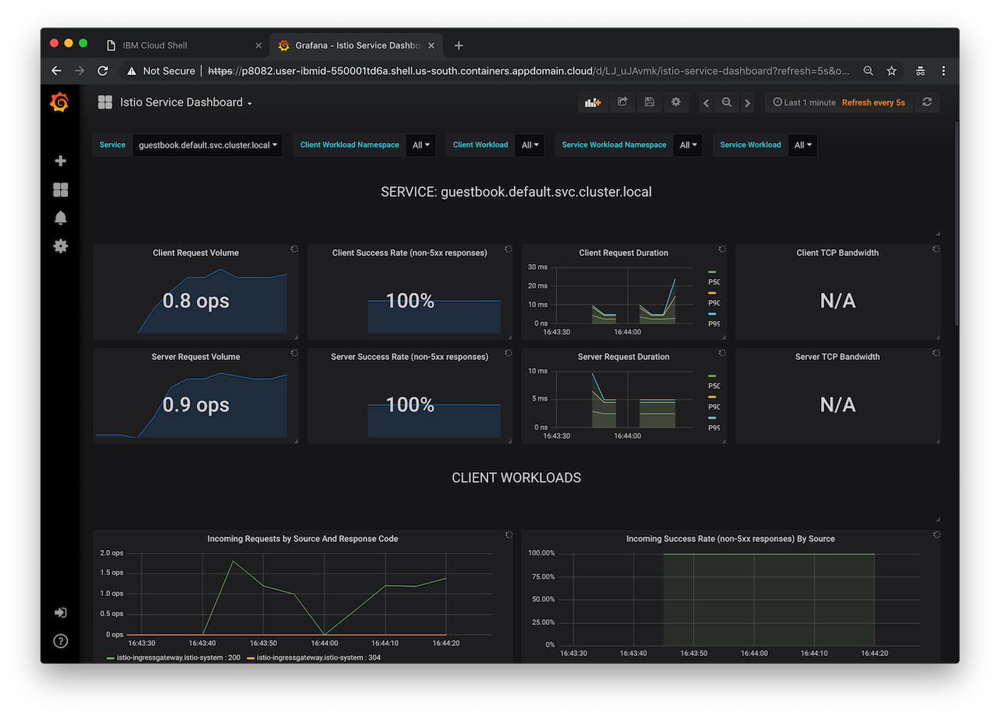
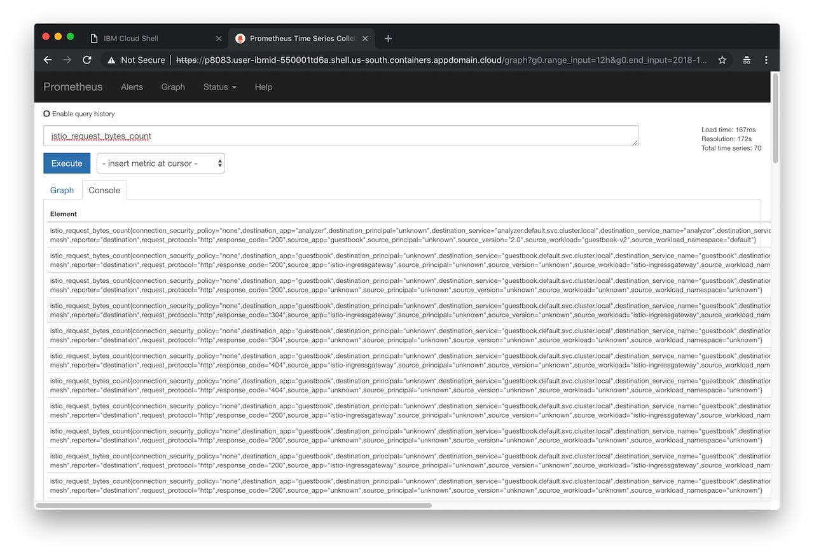

# Exercise 4 - Observe service telemetry: metrics and tracing

### Challenges with microservices

We all know that microservice architecture is the perfect fit for cloud native applications and it increases the delivery velocities greatly. Envision you have many microservices that are delivered by multiple teams, how do you observe the the overall platform and each of the service to find out exactly what is going on with each of the services?  When something goes wrong, how do you know which service or which communication among the few services are causing the problem?

### Istio telemetry

Istio's tracing and metrics features are designed to provide broad and granular insight into the health of all services. Istio's role as a service mesh makes it the ideal data source for observability information, particularly in a microservices environment. As requests pass through multiple services, identifying performance bottlenecks becomes increasingly difficult using traditional debugging techniques. Distributed tracing provides a holistic view of requests transiting through multiple services, allowing for immediate identification of latency issues. With Istio, distributed tracing comes by default. This will expose latency, retry, and failure information for each hop in a request.

You can read more about how [Istio mixer enables telemetry reporting](https://istio.io/docs/concepts/policy-and-control/mixer.html).

### Configure Istio to receive telemetry data

1. Verify that the Grafana, Prometheus, Kiali and Jaeger add-ons were installed successfully. All add-ons are installed into the `istio-system` namespace.

    ```shell
    kubectl get pods -n istio-system
    kubectl get services -n istio-system
    ```

3. Obtain the guestbook endpoint to access the guestbook.

    You can access the guestbook via the external IP for your service as guestbook is deployed as a load balancer service. Get the EXTERNAL-IP of the guestbook service via output below:

    ```shell
    kubectl get service guestbook -n default
    ```

    Go to this external ip address in the browser to try out your guestbook. This service will route you to either v1 or v2, at random. If you wish to see a different version, you'll need to do a hard refresh (`cmd + shift + r` on a mac, or `ctrl + f5` on a PC). Alternatively, you can `curl` the address.



1. Generate a small load to the app, replacing guestbook_IP with your own IP.

    ```shell
    for i in {1..20}; do sleep 0.5; curl http://<guestbook_IP>/; done
    ```

## View guestbook telemetry data


#### Grafana

1.  Expose Grafana on the Load Balancer so you can access it over the web:

    ```shell
    kubectl expose deployment grafana -n istio-system --name=grafana-external --type=LoadBalancer --port=80 --target-port=3000
    ```
    > Note: Normally, you would securely port-forward to Grafana on your local machine by running `istioctl dashboard grafana`.

2.  Grab the URL to access your Grafana dashboard:

    ```shell
    kubectl get svc/grafana-external -n istio-system
    ```

    Sample output:
    ```
    NAME               TYPE           CLUSTER-IP      EXTERNAL-IP     PORT(S)          AGE
    grafana-external   LoadBalancer   172.21.177.42   <your_ip_here>  3000:32011/TCP   114s
    ```

    Go to the External IP to access Grafana: `http://your-ip-here/`

3. Click on Home -> Istio -> Istio Service Dashboard.
4.  Select `guestbook` in the Service drop down.
5. In a different tab, visit the guestbook application and refresh the page multiple times to generate some load.

    

    This Grafana dashboard provides metrics for each workload. Explore the other dashboards provided as well.


#### Kiali

Kiali is an open-source project that installs as an add-on on top of Istio to visualize your service mesh. It provides deeper insight into how your microservices interact with one another, and provides features such as circuit breakers and request rates for your services.

1. Create a secret which will be used to set the login credentials for Kiali

    > ```shell
    > cat <<EOF | kubectl apply -f -
    > apiVersion: v1
    > kind: Secret
    > metadata:
    >   name: kiali
    >   namespace: istio-system
    >   labels:
    >     app: kiali
    > type: Opaque
    > data:
    >   username: "YWRtaW4="
    >   passphrase: "YWRtaW4="
    > EOF
    > ```

1.  Expose Kiali on the Load Balancer so you can access it over the web:

    ```shell
    kubectl expose deployment kiali -n istio-system --name=kiali-external --type=LoadBalancer --port=80 --target-port=20001
    ```

1.  Grab the URL to access your Kiali dashboard:

    ```shell
    kubectl get svc/kiali-external -n istio-system
    ```

    Sample output:
    ```
    NAME             TYPE           CLUSTER-IP      EXTERNAL-IP     PORT(S)           AGE
    kiali-external   LoadBalancer   172.21.18.146   <your_ip_here>  20001:31374/TCP   3m52s
    ```
    Visit the External IP to access Kiali: `http://your-ip-here/`
1.  If you see an error message "The Kiali secret is missing...", wait a couple of minutes and hit Refresh.
1.  Login with the following username/password: `admin/admin`.
1. Click the "Graph" tab on the left side and select the default namespace to see the a visual service graph of the various services in your Istio mesh. You can see request rates as well by clicking the "Edge Labels" tab and choosing "Traffic rate per second".
 
    > Info: You'll need to access your Guestbook application and type an entry for the graph to be generated and connected properly.

1. In a different tab, visit the guestbook application and refresh the page multiple times to generate some load.

Kiali has a number of views to help you visualize your services. Click through the various tabs to explore the service graph, and the various views for workloads, applications and services.

     


####[Continue to Exercise 4 - Telemetry](../exercise-5/README.md)


<!-- #### Prometheus

1. Expose Prometheus on the Load Balancer so you can access it over the web:

    ```shell
    kubectl expose deployment prometheus -n istio-system --name=prometheus-external --type=LoadBalancer
    ```

2. Grab the URL to access your Prometheus dashboard:

    ```shell
    kubectl get svc/prometheus-external -n istio-system
    ```

    Sample output:
    ```
    NAME                  TYPE           CLUSTER-IP      EXTERNAL-IP     PORT(S)          AGE
    prometheus-external   LoadBalancer   172.21.177.42   <your_ip_here>  9090:32357/TCP   8s
    ```
    Combine the External IP and the port 9090 to access Prometheus: `http://your-ip-here:3000`
3. Click on the web preview icon and select port 8083, and in the “Expression” input box, enter: `istio_request_bytes_count`. Click Execute.
4. Then try another query: `istio_requests_total{destination_service="guestbook.default.svc.cluster.local", destination_version="2.0"}`



5. Explore the Graph tab as well.
6. Use Ctrl-C to exit the port-foward when you are done. -->


